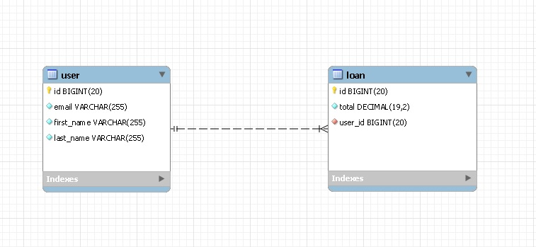

# CashOnile-backend

### Herramientas Utilizadas:

* **[Java](https://jdk.java.net/java-se-ri/11)** - JDK 11
* **[MySQL](https://www.mysql.com/)** - Para la base de datos.
* **[Maven](https://maven.apache.org/)** - Como manejador de dependencias.
* **[Spring boot (MVC y JPA)](https://spring.io/)** - Para el mapeo de los objetos con la base de datos.
* **[H2](https://mvnrepository.com/artifact/com.h2database/h2)** - BD en memoria para los test.
* **[JUnit](https://mvnrepository.com/artifact/junit/junit)** - Para los test.
* **[Eclipse](https://www.eclipse.org/downloads/packages/)** -Entorno de desarrollo.
* **[MySQL-Workbench](https://dev.mysql.com/downloads/mysql/)** - Interfaz para la administración de bases de datos.


### URL BASE
```http://localhost:8080 ```

### Instrucciones

__En MySQL:__
 hay que crear una base de datos con el nombre cashonline. Las tablas se recrean cada vez que se corre la app.

``` sql
CREATE SCHEMA cashonline;
```


__Levantar el proyecto"__
 
Antes de ejecutarlo, entrá al archivo  [application.properties](https://github.com/sebastianomsk/CashOnile-backend/blob/main/src/main/resources/application.properties) (Ctrl + Shift + R > tipeá application y te aparece) 
y cambiá la contraseña de root al de tu BD. 

```
- spring.datasource.username=root

- spring.datasource.password=
```

La aplicación carga los usuarios y los prestamos desde el [bootstrap](https://github.com/sebastianomsk/CashOnile-backend/blob/main/src/main/java/com/examen/cashonline/Bootstrap.java) al iniciar.

### Endpoints/Flags que pueden utilizar

* User
  - GET http://localhost:8080/users/{id}
  - POST http://localhost:8080/users
  - DELETE http://localhost:8080/users/{id}

* Loan

  - GET http://localhost:8080/loans?page={page}&size={size}
  - GET http://localhost:8080/loans?page={page}&size={size}&user_id={user_id}

## Diagrama entidad-relación



